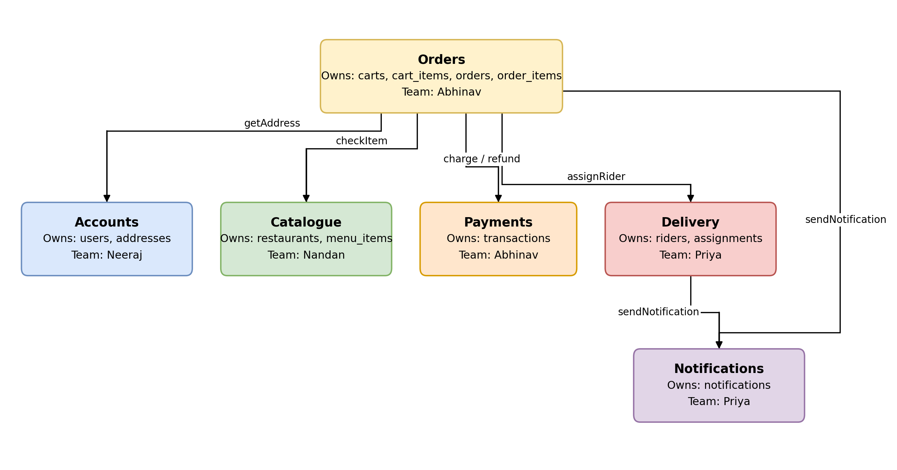
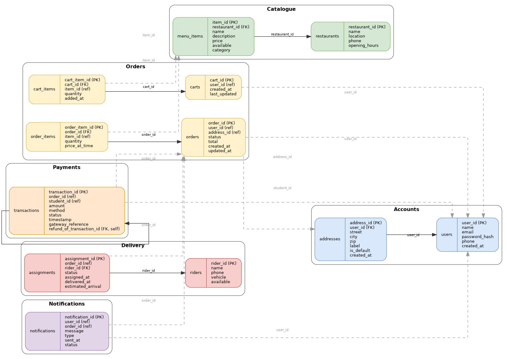

# CampusEats

CampusEats is a planned campus food-ordering platform designed as a set of independently deployable services. Students will be able to discover campus restaurants, build a cart, place and pay for orders, follow delivery progress, and receive status notifications.

> **Project status:** architecture and data design are complete; application services, deployment configuration, and a runnable local environment have not yet been added.

## Architecture at a glance

The system is organized around six service-owned domains. Each service is the source of truth for its own data and interacts with other services only through published contracts—not direct database access.

| Service | Data owned | Primary responsibility | Owner |
| --- | --- | --- | --- |
| Accounts | `users`, `addresses` | Identity, authentication, and delivery addresses | Neeraj |
| Catalogue | `restaurants`, `menu_items` | Restaurant discovery, menus, availability, and prices | Nandan |
| Orders | `carts`, `cart_items`, `orders`, `order_items` | Cart management and order lifecycle orchestration | Abhinav |
| Payments | `transactions` | Charges, refunds, and gateway references | Abhinav |
| Delivery | `riders`, `assignments` | Rider allocation and delivery tracking | Priya |
| Notifications | `notifications` | Customer-facing order and delivery messages | Priya |

### Order workflow

The Orders service coordinates order placement while preserving service boundaries:

1. Retrieves the selected delivery address from **Accounts** (`getAddress`).
2. Confirms item availability and pricing with **Catalogue** (`checkItem`).
3. Creates a charge or refund through **Payments**.
4. Requests rider allocation from **Delivery** (`assignRider`).
5. Triggers customer updates through **Notifications**; Delivery also sends status-change notifications.

## Data design

The schema defines 12 tables across the six bounded contexts. Foreign keys are used only within a service boundary—for example, `addresses.user_id → users.user_id` and `order_items.order_id → orders.order_id`. References that cross service boundaries (such as an order's `user_id`, a transaction's `order_id`, or a notification's `order_id`) are intentionally logical references, preserving database independence.

Notable design choices:

- Order items retain `price_at_time` to preserve the purchase price after a menu changes.
- Transactions support refunds through the self-referencing `refund_of_transaction_id` field.
- Cart and order records retain creation and update timestamps; delivery assignments retain assignment, delivery, and estimated-arrival timestamps.
- UUID primary keys are used throughout the schema.

## Repository guide

| Path | Contents |
| --- | --- |
| [`docs/brief.md`](docs/brief.md) | Product scope, actors, service ownership, and proposed service operations. |
| [`docs/system-design/design.pdf`](docs/system-design/design.pdf) | Six-page design benchmark covering services, contracts, and the schema. |
| [`docs/system-design/services.drawio`](docs/system-design/services.drawio) | Editable Draw.io source for the service interaction diagram. |
| [`docs/system-design/services.png`](docs/system-design/services.png) | Rendered service interaction diagram. |
| [`docs/system-design/schema.sql`](docs/system-design/schema.sql) | SQL DDL for the proposed service-owned data model. |
| [`docs/system-design/schema.drawio`](docs/system-design/schema.drawio) | Editable Draw.io source for the logical schema diagram. |
| [`docs/system-design/schema.png`](docs/system-design/schema.png) | Rendered logical schema diagram. |
| [`docs/http-log.md`](docs/http-log.md) | Recorded HTTP request/response examples using the GitHub REST API. |
| [`docs/network-analysis.md`](docs/network-analysis.md) | Chrome DevTools network analysis of a deployed Next.js application. |
| [`docs/http-analysis-evidence/`](docs/http-analysis-evidence/) | Supporting screenshots for the HTTP and network analysis. |

## Current scope and next steps

This repository currently contains design documentation and evidence from HTTP/network analysis. There is no application source code, package manifest, container configuration, test suite, or runtime command yet.

The next implementation phase should establish service contracts, select the technology stack, create one independently runnable service, and add local orchestration and automated tests before expanding to the remaining services.

## Team

| Member | Focus |
| --- | --- |
| [Abhinav Gupta](https://github.com/ABHINAVX03) | Orders, Payments, and architecture |
| Nandan Kabra | Catalogue |
| Neeraj Sharma | Accounts |
| Priya | Delivery and Notifications |

Developed for CS 543 – Web Services at IIIT Vadodara.
